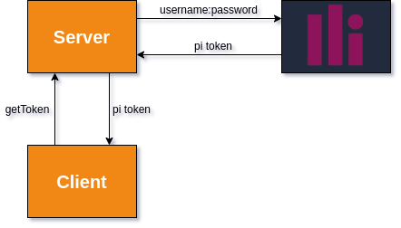

# Panintelligence Embedding Example Fullstack App
This small application should serve as a barebones minimap application that shows how Panintelligence can be embedded.

It serves to illustrate an implementation of embedding Panintelligence into your application like below:

Where your client asks for a token to your server and your server, who has saved the credentials of a Panintelligence admin user, will then make the request to Panintelligence via the [API](https://app.swaggerhub.com/apis-docs/panintelligence/dashboard/).

# How to use this
Check the [backend](./backend/) code. You'll find that it is just receiving a request from the frontend for a token, and sending it on to Panintelligence with the appropriate credentials. This doesn't cover how you're user is authenticated in your own application, but usually you'd have a way to tell that your app user is that Panintelligence user.

For this, the [frontend](./frontend/) is a simple React application that is embedding a Panintelligence chart.

## Prerequisites
* node
* npm
* [Panintelligence Dashboard](https://www.panintelligence.com/)
  * that is [configured for embedding](https://panintelligence.atlassian.net/wiki/spaces/PD/pages/181010582/Embedding+Dashboards+Charts)

## Pre-Running
Before running, you need to run `npm install`

## Running
To run this app you can run `./run.sh` on Linux or `run.bat` on Windows.

You'll find that the scripts have some environment variables set up, you may need to change these.
